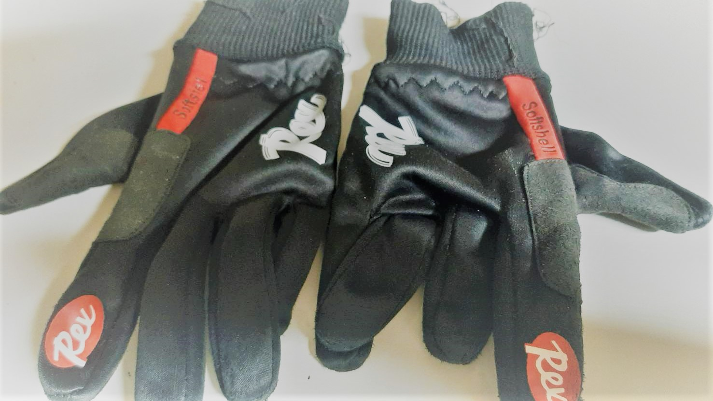

# Exercises for Full stack web development Tutorial Course
This repository is where you can find some really easy samples for the mentioned videos.

## Summary
This time, the website is mainly built with the help of front-end open source toolki, Bootstrap. 

## Outcome


Here is my code. (css style and photos are saved in the additional files)
```
<!doctype html>
<html lang="en">

<head>
  <!-- Required meta tags -->
  <meta charset="utf-8">
  <meta name="viewport" content="width=device-width, initial-scale=1, shrink-to-fit=no">
  <script src="https://kit.fontawesome.com/69b9ae070e.js" crossorigin="anonymous"></script>
  <!-- Bootstrap CSS -->
  <link rel="stylesheet" href="https://stackpath.bootstrapcdn.com/bootstrap/4.3.1/css/bootstrap.min.css"
    integrity="sha384-ggOyR0iXCbMQv3Xipma34MD+dH/1fQ784/j6cY/iJTQUOhcWr7x9JvoRxT2MZw1T" crossorigin="anonymous">
  <link rel="stylesheet" href="style.css">
  <title>Best Warehouse in the region!</title>
</head>

<body>
  <!-- NavBar -->

  <nav class="navbar navbar-expand-lg navbar-light bg-light">
    <div class="container-fluid">
      <a class="navbar-brand" href="clothing_brand.html">FUHOUSE</a>
      <button class="navbar-toggler" type="button" data-toggle="collapse" data-target="#navbarSupportedContent"
        aria-controls="navbarSupportedContent" aria-expanded="false" aria-label="Toggle navigation">
        <span class="navbar-toggler-icon"></span>
      </button>

      <div class="collapse navbar-collapse" id="navbarSupportedContent">
        <ul class="navbar-nav mr-auto">
          <li class="nav-item active">
            <a class="nav-link" href="#">Home <span class="sr-only">(current)</span></a>
          </li>
          <li class="nav-item">
            <a class="nav-link" href="#">About</a>
          </li>
          <li class="nav-item dropdown">
            <a class="nav-link dropdown-toggle" href="#" id="navbarDropdown" role="button" data-toggle="dropdown"
              aria-haspopup="true" aria-expanded="false">
              Category
            </a>
            <div class="dropdown-menu" aria-labelledby="navbarDropdown">
              <a class="dropdown-item" href="#">Gloves</a>
              <div class="dropdown-divider"></div>
              <a class="dropdown-item" href="#">Beanies</a>
              <div class="dropdown-divider"></div>
              <a class="dropdown-item" href="#">Facemasks</a>
            </div>
          </li>
          <li class="nav-item">
            <a class="navbar-brand" href="#" tabindex="-1" aria-disabled="true">
              
            </a>
          </li>
        </ul>
        <form class="form-inline my-2 my-lg-0">
          <input class="form-control mr-sm-2" type="search" placeholder="Search" aria-label="Search">
          <button class="btn btn-outline-success my-2 my-sm-0" type="submit">Search</button>
        </form>
      </div>
    </div>
  </nav>

  <div class="jumbotron ">

    <div class="row">
      <div class="col-sm"></div>
      <div class="col-sm-12 col-md-6">
        <h1 class="display-4">Best Price</h1>
        <p class="lead">If you're looking for clothing with good quality and unbeatable price, then you are just in the
          right place.
          Underneath you can find our best-seller through out the year and much more products that you dont want to
          miss!</p>
        <hr class="my-4">
      </div>
      <div class="col-sm"></div>
    </div>
    <!-- carousel section starts -->
    <div class="row">
      <div class="col-sm"></div>
      <div class="col-sm-12 col-md-6">
        <div id="carouselExampleFade" class="carousel slide carousel-fade" data-ride="carousel">
          <div class="carousel-inner">
            <div class="carousel-item active">
              
            </div>
            <div class="carousel-item">
              
            </div>
            <div class="carousel-item">
              
            </div>
          </div>
          <a class="carousel-control-prev" href="#carouselExampleFade" role="button" data-slide="prev">
            <span class="carousel-control-prev-icon" aria-hidden="true"></span>
            <span class="sr-only">Previous</span>
          </a>
          <a class="carousel-control-next" href="#carouselExampleFade" role="button" data-slide="next">
            <span class="carousel-control-next-icon" aria-hidden="true"></span>
            <span class="sr-only">Next</span>
          </a>
        </div>
      </div>
      <div class="col-sm"></div>
    </div>
    <!-- carousel section fnishes -->

  </div>

  <div class="section-description">
    <div class="row">
      <div class="col-sm col-md-1 offset-md-2">
        
      </div>
      <div class="col-sm-12 col-md-6">
        <p>Your feelings are important, so as our environment. Every item you buy from our store is specially designed
          by our
          talented teams from Jupiter. And all of them is certified by the ministry of environment here in Saturn,
          making sure that
          they come with best quality and are not harmful to your planet, earth. Wanna know more? Klick the button below
          or scan the QR code!
        </p>
        <div class="row">
          <div class="col-sm buttonWrapper">
            <button type="button" class="btn btn-primary btnCenter" data-toggle="modal" data-target="#modalLearnMore">
              Learn More
            </button>
          </div>
        </div>
      </div>
      <div class="col-sm col-md-3"></div>

    </div>
  </div>

  <div class="section-category">
    <div class="container-fluid sectionWrapper">
      <div class="row">
        <div class="col-sm-12 col-md-4 sectionWrapper">
          
          <div class="row imgPad">
            <button type="button" class="btn btn-primary btnCenter" data-toggle="modal"
              data-target="#UNIQLO ">Facemasks</button>
          </div>
        </div>
        <div class="col-sm-12 col-md-4 sectionWrapper">
          
          <div class="row imgPad">
            <button type="button" class="btn btn-primary btnCenter" data-toggle="modal"
              data-target="#ZARA">Gloves</button>
          </div>
        </div>
        <div class="col-sm-12 col-md-4 sectionWrapper">
          
          <div class="row imgPad">
            <button type="button" class="btn btn-primary btnCenter" data-toggle="modal"
              data-target="#Havaianas">Beanies</button>
          </div>
        </div>
      </div>
    </div>
  </div>


  <footer class="bg-inverse">
    <div class="container-fluid">
      <div class="row">
        <div class="col-sm-12 col-lg-3"></div>
        <div class="col-sm-12 col-lg-5 socialWrapper">
          <a href="https://www.facebook.com/"> <i class="fab fa-facebook-f fa-3x" aria-hidden="true"></i> </a>
          <a href="https://www.instagram.com/"> <i class="fab fa-instagram fa-3x"aria-hidden="true"></i> </a>
          <a href="https://www.tiktok.com/"> <i class="fab fa-tiktok fa-3x"aria-hidden="true"></i> </a>
        </div>
        <div class="col-sm-12 col-lg-4">
          <div class=" text-center text-lg-start">
            <div class="text-center p-3">
              © 2021 Copyright:
              <a class="text-dark" href="https://fushoue.com/">fuhouse.com</a>
            </div>
          </div>
        </div>
      </div>
    </div>
  </footer>


  <!-- modal -->
  <div class="modal" tabindex="-1" role="dialog" id="modalLearnMore">
    <div class="modal-dialog" role="document">
      <div class="modal-content">
        <div class="modal-header">
          <h5 class="modal-title">Modal title</h5>
          <button type="button" class="close" data-dismiss="modal" aria-label="Close">
            <span aria-hidden="true">&times;</span>
          </button>
        </div>
        <div class="modal-body">
          <form>
            <div class="form-group">
              <label for="exampleInputEmail1">Email address</label>
              <input type="email" class="form-control" id="exampleInputEmail1" aria-describedby="emailHelp"
                placeholder="Enter email">
              <small id="emailHelp" class="form-text text-muted">We'll never share your email with anyone else.</small>
            </div>
            <div class="form-group">
              <label for="exampleInputPassword1">Password</label>
              <input type="password" class="form-control" id="exampleInputPassword1" placeholder="Password">
            </div>
            <div class="form-group form-check">
              <input type="checkbox" class="form-check-input" id="exampleCheck1">
              <label class="form-check-label" for="exampleCheck1">Remember Me</label>
            </div>
          </form>
        </div>
        <div class="modal-footer">
          <button type="button" class="btn btn-secondary" data-dismiss="modal">Close</button>
        </div>
      </div>
    </div>
  </div>


  <!-- UNIQLO Modal -->
  <div class="modal" tabindex="-1" role="dialog" id="UNIQLO">
    <div class="modal-dialog" role="document">
      <div class="modal-content">
        <div class="modal-header">
          <h5 class="modal-title">UNIQLO</h5>
          <button type="button" class="close" data-dismiss="modal" aria-label="Close">
            <span aria-hidden="true">&times;</span>
          </button>
        </div>
        <div class="modal-body">
          <iframe class="video-fluid" src="https://www.youtube.com/embed/_Cu8JL5UDak" frameborder="0"
            allow="accelerometer; autoplay; clipboard-write; encrypted-media; gyroscope; picture-in-picture"
            allowfullscreen></iframe>
        </div>
        <div class="modal-footer">
          <button type="button" class="btn btn-outline-success" data-dismiss="modal">Close</button>
        </div>
      </div>
    </div>
  </div>

  <!-- ZARA Modal -->
  <div class="modal" tabindex="-1" role="dialog" id="ZARA">
    <div class="modal-dialog" role="document">
      <div class="modal-content">
        <div class="modal-header">
          <h5 class="modal-title">UNIQLO</h5>
          <button type="button" class="close" data-dismiss="modal" aria-label="Close">
            <span aria-hidden="true">&times;</span>
          </button>
        </div>
        <div class="modal-body">
          <iframe class="video-fluid" src="https://www.youtube.com/embed/LNJz_gFZvug" frameborder="0"
            allow="accelerometer; autoplay; clipboard-write; encrypted-media; gyroscope; picture-in-picture"
            allowfullscreen></iframe>
        </div>
        <div class="modal-footer">
          <button type="button" class="btn btn-outline-success" data-dismiss="modal">Close</button>
        </div>
      </div>
    </div>
  </div>

  <!-- Havaianas Modal -->
  <div class="modal" tabindex="-1" role="dialog" id="Havaianas">
    <div class="modal-dialog" role="document">
      <div class="modal-content">
        <div class="modal-header">
          <h5 class="modal-title">UNIQLO</h5>
          <button type="button" class="close" data-dismiss="modal" aria-label="Close">
            <span aria-hidden="true">&times;</span>
          </button>
        </div>
        <div class="modal-body">
          <iframe class="video-fluid" src="https://www.youtube.com/embed/pRgdsSNkWfc" frameborder="0"
            allow="accelerometer; autoplay; clipboard-write; encrypted-media; gyroscope; picture-in-picture"
            allowfullscreen></iframe>
        </div>
        <div class="modal-footer">
          <button type="button" class="btn btn-outline-success" data-dismiss="modal">Close</button>
        </div>
      </div>
    </div>
  </div>


  <!-- Optional JavaScript -->
  <!-- jQuery first, then Popper.js, then Bootstrap JS -->
  <script src="https://code.jquery.com/jquery-3.3.1.slim.min.js"
    integrity="sha384-q8i/X+965DzO0rT7abK41JStQIAqVgRVzpbzo5smXKp4YfRvH+8abtTE1Pi6jizo"
    crossorigin="anonymous"></script>
  <script src="https://cdnjs.cloudflare.com/ajax/libs/popper.js/1.14.7/umd/popper.min.js"
    integrity="sha384-UO2eT0CpHqdSJQ6hJty5KVphtPhzWj9WO1clHTMGa3JDZwrnQq4sF86dIHNDz0W1"
    crossorigin="anonymous"></script>
  <script src="https://stackpath.bootstrapcdn.com/bootstrap/4.3.1/js/bootstrap.min.js"
    integrity="sha384-JjSmVgyd0p3pXB1rRibZUAYoIIy6OrQ6VrjIEaFf/nJGzIxFDsf4x0xIM+B07jRM"
    crossorigin="anonymous"></script>
</body>

</html>
```
## Acknowledgments

* The videos are from MERN Stack Web Development Tutorial Course/ [See their channel](https://www.youtube.com/channel/UCDsEHTvh-YO80AZna7X7UVA)
